# TaskSmith

TaskSmith is a task scheduling and management application that leverages message queues with BullMQ and Redis for efficient background processing. It allows users to create, manage, and view tasks through a REST API. Built with Node.js, Express, PostgreSQL, and Redis, TaskSmith provides a robust solution for handling asynchronous task processing at scale.

# Features

- **High Performance**: Processes
- **Fleible Scheduling**: One-time, delayed, or recurring (cron) jobs
- **Priority Queues**: Critical tasks get processed first 
- **Retry Mechanism**: Automatic retries upon failure in job processing
- **Distributed Workers**: For easy scaling of the system
- **Persistent Storage**: All tasks are stored in a Postgres DB
- **Docker Ready**: One command deployment

# Use Cases 

- Email campaigns with scheduled delivery
- Database operations 
- Background image/video processing
- Periodic report generation

# Tech Stack

- **Backend:** Node.js (Express)
- **Database:** PostgreSQL (managed via Drizzle ORM)
- **Message Queue & Caching:** Redis with BullMQ

# Architecture 

```mermaid
graph TB
    Client["👤 Client"]
    
    Client -->|POST /tasks/create| ExpressApp["Express Server"]
    Client -->|GET /tasks| ExpressApp
    Client -->|GET /tasks/:id| ExpressApp
    Client -->|GET /queue/stats| ExpressApp
    
    ExpressApp --> TaskRouter["Task Router"]
    ExpressApp --> QueueRouter["Queue Router"]
    
    TaskRouter --> TaskCtrl["Task Controller"]
    QueueRouter --> QueueCtrl["Queue Controller"]
    
    TaskCtrl -->|Validate| Zod["Zod Schema<br/>Validation"]
    Zod -->|Valid| JobHandler["Job Handlers"]
    
    JobHandler -->|Check Type| ImmediateJob["Immediate Job?"]
    JobHandler -->|Check Type| ScheduledJob["Scheduled Job?"]
    JobHandler -->|Check Type| RepeatableJob["Repeatable Job?"]
    
    ImmediateJob -->|Add| Queue["🔴 BullMQ Queue<br/>Attempts: 3<br/>Backoff: exponential"]
    ScheduledJob -->|Add with Delay| Queue
    RepeatableJob -->|Add with Cron| Queue
    
    QueueCtrl --> Queue
    
    Queue -->|Pick Job| W1["Worker 1<br/>concurrency: 5"]
    Queue -->|Pick Job| W2["Worker 2<br/>concurrency: 5"]
    Queue -->|Pick Job| W3["Worker 3<br/>concurrency: 5"]
    Queue -->|Pick Job| W4["Worker 4<br/>concurrency: 5"]
    
    W1 -->|Status: PROCESSING| Processor["Task Processor<br/>taskProcessor.ts"]
    W2 -->|Status: PROCESSING| Processor
    W3 -->|Status: PROCESSING| Processor
    W4 -->|Status: PROCESSING| Processor
    
    Processor -->|task.type| Switch{"Task Type"}
    
    Switch -->|api-call| ApiCall["makeApiCall<br/>HTTP requests"]
    Switch -->|file-operation| FileOp["performFileOperation<br/>Read/Write files"]
    Switch -->|database-operations| DbOp["performDatabaseOperation<br/>Query tasks"]
    Switch -->|default| DefaultWork["performDefaultWork<br/>CPU intensive"]
    
    ApiCall --> Update["Update Task Status"]
    FileOp --> Update
    DbOp --> Update
    DefaultWork --> Update
    
    Update -->|COMPLETED| TaskModel["Task Model<br/>updateTask"]
    Update -->|FAILED| TaskModel
    Update -->|RETRYING| TaskModel
    
    TaskModel --> ORM["Drizzle ORM"]
    
    ORM --> DB["🐘 PostgreSQL<br/>tasks table"]
    
    Queue -.->|Cache| Redis["🔴 Redis Cache"]
    
    style Client fill:#e1f5ff,stroke:#01579b
    style ExpressApp fill:#fff3e0,stroke:#e65100
    style Queue fill:#ffebee,stroke:#b71c1c
    style W1 fill:#c8e6c9,stroke:#1b5e20
    style W2 fill:#c8e6c9,stroke:#1b5e20
    style W3 fill:#c8e6c9,stroke:#1b5e20
    style W4 fill:#c8e6c9,stroke:#1b5e20
    style Processor fill:#fff9c4,stroke:#f57f17
    style DB fill:#f3e5f5,stroke:#4a148c
    style Redis fill:#ffebee,stroke:#b71c1c
    style Switch fill:#ffe0b2,stroke:#e65100
```



# Getting Started

1. Clone the repository:

```bash
git clone https://github.com/NamanD10/TaskSmith.git
cd TaskSmith
npm install

```
2. Install dependencies

```bash
npm install
```

3. Configure your database and Redis connection in the `.env` file before running.
Sample .env file
```bash 
DATABASE_URL="postgres://postgres:password@db:5432/mydb"
PORT = 3000
REDIS_HOST = host_address
REDIS_PORT = 6379
REDIS_USERNAME = default
REDIS_PASSWORD = my_pwd
```

4. Build and start the application
```bash
npm run build
npm start
```

# API Endpoints

- `POST /tasks/create`
Example of a one-time immediate task
```bash
  POST /tasks/create
  {
    "title": "Example immediate task ",
    "description": "Example task for the API",
    "type": "Email",
    "isRepeatable": false,
    "priority" : 3    //1-3 (1 = highest)
  }
```
Example of a scheduled task
```bash
  POST /tasks/create
  {
    "title": "Example scheduled task ",
    "description": "Example scheduled task for the API",
    "type": "Email",
    "scheduledAt": "Jan 08 2026 16:15:00",   //date in the simple JS Date object format 
    "isRepeatable": false,
    "priority" : 3    //1-3 (1 = highest)
  }
```

Example of a repeatable (cron job) task
```bash
  POST /tasks/create
  {
    "title": "Example repeatable task ",
    "description": "Example repeatable task for the API",
    "type": "Email",
    "isRepeatable": true,
    "repeatPattern": "0 12 * * *"     //cron pattern
    "priority" : 3    //1-3 (1 = highest)
  }
```

- `GET /tasks`
  - Retrieve a list of all tasks.

- `GET /tasks/:id`
  - Retrieve details of a specific task.

- `DELETE /tasks/:id`
  - Delete a task

- `PUT /tasks/:id`
  - Update the task data 
// It is not recommended to use the PUT request without proper study of the codebase

- `GET /queue/stats` 
  - Get the queue statistics, involving information like active, pending, delayed, completed or failed jobs and some other      metrics.

# Contact
For questions or support, contact (namandubey10@gmail.com).